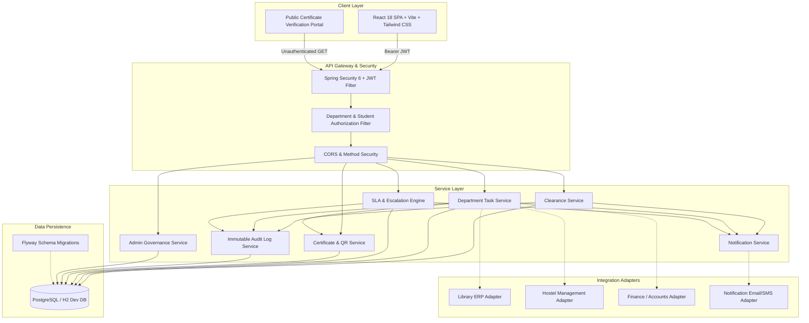

# CampusClear Architecture Documentation

## 1. System Vision & Overview

**CampusClear** is an automated digital campus governance platform engineered to eliminate paper-based no-dues clearance forms, arbitrary administrative delays, and repeated physical department visits.

The platform provides:
- **One Student Request**: A student initiates exactly one digital clearance request with designated purpose (Graduation, Semester Transfer, Course Completion).
- **Parallel Departmental Verification**: The system dispatches verification tasks to all active departments (Library, Hostels, Sports, Accounts).
- **Two-Day Accountability SLA**: Strict, configurable 48-hour processing window per department calculated from task assignment timestamp.
- **Escalation & Delay Management**: Tasks exceeding SLA trigger automated escalation to Department Heads; delays require mandatory categorization, explanation, expected resolution date, and next actions.
- **Automatic Cryptographic Digital Certificate**: Once all required departments approve, a tamper-resistant PDF certificate is automatically compiled with embedded ZXing QR code and SHA-256 integrity hash.
- **Public Verification**: Third-party employers and institutions can scan the QR code to verify credential authenticity on a privacy-preserving public endpoint.

---

## 2. High-Level Architecture Diagram



---

## 3. Core Component Layers

### 3.1 Controller Layer (`com.innovx.nodues.controller`)
- Restful endpoints strictly returning DTOs (never exposing JPA entity models directly).
- Adheres to HTTP semantics (200 OK, 201 Created, 400 Bad Request, 401 Unauthorized, 403 Forbidden, 404 Not Found).
- Input validation via Jakarta `@Valid` constraints.

### 3.2 Security & Authorization Layer (`com.innovx.nodues.security`)
- **Stateless JWT Tokens**: Signed with HMAC-SHA256 containing user ID, roles, studentId, and departmentId.
- **Department-Level Isolation (`DepartmentSecurityService`)**:
  - Staff belonging to Library cannot access or approve Accounts tasks.
  - Students can only view their own clearance records.
  - Department Heads can reassign and resolve escalations for their department.
  - Admins retain system-wide supervisory privileges.

### 3.3 Business Services Layer (`com.innovx.nodues.service`)
1. **`ClearanceService`**: Coordinates single request initiation, enforces the rule of only one active clearance request per student, queries active departments, and sets SLA deadlines.
2. **`TaskService`**: Enforces authorized department actions:
   - **Approve**: Enforces verified zero-dues record; triggers certificate generation if all sibling tasks are approved.
   - **Reject**: Mandates `reasonTitle`, `explanation`, and `requiredStudentAction`.
   - **Mark Delayed**: Mandates `category` (enum), `explanation`, `expectedResolutionDate`, and `nextAction`.
3. **`SlaEscalationService`**: Scheduled background worker and on-demand evaluator scanning for tasks where `dueAt < now` and status is `PENDING` or `DELAYED`. Marks task as overdue, creates escalation record, notifies student, staff, and head, and writes immutable audit record.
4. **`CertificateService`**: OpenPDF and ZXing QR engine. Generates unique certificate ID, computes SHA-256 cryptographic verification digest, renders PDF with institutional crest and department stamps, and powers public verification.
5. **`AuditLogService`**: Writes immutable records with `REQUIRES_NEW` transaction propagation. Records user ID, username, role, department, action, entity type, entity ID, previous status, new status, and details.

---

## 4. Future Integration Architecture & Resilient Adapters

The platform is designed with integration abstractions for future institutional connectivity:

```
[Clearance Workflow] ---> [Integration Adapter Interface]
                               |
            +------------------+------------------+
            |                                     |
    [ERP Adapter (Future)]             [Manual Fallback (MVP)]
    - Koha Library REST API            - Authorized Staff Verification
    - Hostel Housing System            - Remarks & Reference Number
    - SAP/Tally Accounts ERP           - Digital Audit Trail
```

### Critical Resiliency Rule:
The system **NEVER assumes "No dues = ₹0"** unless an authorized officer or connected ERP actually verifies it. If an integration is offline or unavailable, the system states **"Verification unavailable"** rather than guessing or auto-approving.
