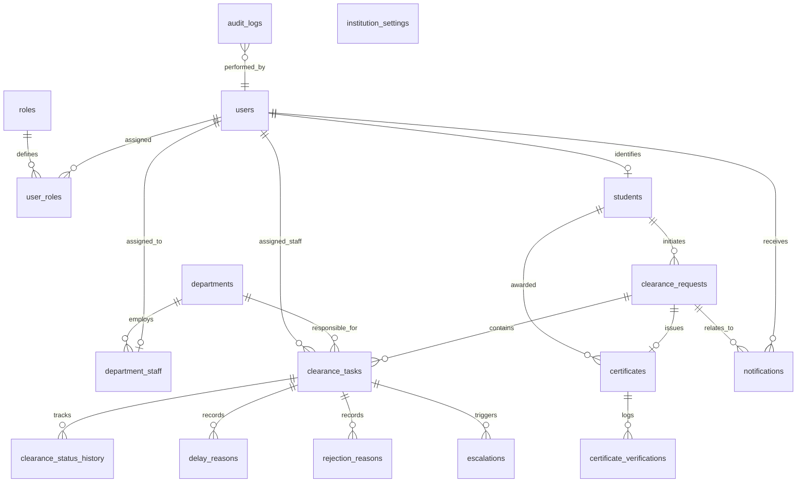

# Database Schema & Entity Relationship Documentation

## 1. Entity Relationship (ER) Diagram

---

## 2. Table Specifications

### 2.1 `users`
| Column | Type | Constraints | Description |
|---|---|---|---|
| `id` | VARCHAR(36) | PRIMARY KEY | UUID identifier |
| `username` | VARCHAR(100) | NOT NULL, UNIQUE | Authentication login handle |
| `email` | VARCHAR(150) | NOT NULL, UNIQUE | Institutional email address |
| `password_hash` | VARCHAR(255) | NOT NULL | BCrypt hashed password |
| `first_name` | VARCHAR(100) | NOT NULL | First legal name |
| `last_name` | VARCHAR(100) | NOT NULL | Last legal name |
| `is_active` | BOOLEAN | NOT NULL, DEFAULT TRUE | User active status |
| `is_demo` | BOOLEAN | NOT NULL, DEFAULT FALSE | Flags demo accounts |
| `created_at` | TIMESTAMP | NOT NULL | Record creation timestamp |
| `updated_at` | TIMESTAMP | NOT NULL | Record update timestamp |

### 2.2 `roles` & `user_roles`
- `roles`: `id`, `name` (`ROLE_STUDENT`, `ROLE_DEPARTMENT_STAFF`, `ROLE_DEPARTMENT_HEAD`, `ROLE_ADMIN`), `description`.
- `user_roles`: `user_id` (FK to `users`), `role_id` (FK to `roles`). Composite primary key.

### 2.3 `students`
| Column | Type | Constraints | Description |
|---|---|---|---|
| `id` | VARCHAR(36) | PRIMARY KEY | Student record UUID |
| `user_id` | VARCHAR(36) | NOT NULL, UNIQUE, FK users | Linked auth user account |
| `student_id` | VARCHAR(50) | NOT NULL, UNIQUE | Institutional ID (e.g. STU-2024-001) |
| `roll_no` | VARCHAR(50) | NOT NULL, UNIQUE | University Roll No |
| `program` | VARCHAR(100) | NOT NULL | Academic degree program |
| `batch_year` | VARCHAR(20) | NOT NULL | Batch year span (e.g. 2022-2026) |
| `academic_department` | VARCHAR(100) | NOT NULL | Academic major department |
| `phone_number` | VARCHAR(25) | NULL | Student telephone contact |

### 2.4 `departments`
| Column | Type | Constraints | Description |
|---|---|---|---|
| `id` | VARCHAR(36) | PRIMARY KEY | Department UUID |
| `code` | VARCHAR(50) | NOT NULL, UNIQUE | Identifier (LIBRARY, HOSTELS, SPORTS, ACCOUNTS) |
| `name` | VARCHAR(150) | NOT NULL | Department official display name |
| `description` | TEXT | NULL | Department clearance scope |
| `official_email` | VARCHAR(150) | NOT NULL | Publicly visible office email |
| `office_location` | VARCHAR(200) | NOT NULL | Physical campus location |
| `official_phone` | VARCHAR(50) | NULL | Office desk telephone |
| `is_active` | BOOLEAN | NOT NULL, DEFAULT TRUE | Active clearance department flag |

### 2.5 `department_staff`
- `id` (UUID), `user_id` (FK `users`), `department_id` (FK `departments`), `is_head` (BOOLEAN), `designation` (VARCHAR).

### 2.6 `clearance_requests`
- `id` (UUID), `student_id` (FK `students`), `academic_year` (VARCHAR), `semester` (VARCHAR), `reason` (VARCHAR), `overall_status` (`PENDING`, `IN_PROGRESS`, `REJECTED`, `BLOCKED`, `COMPLETED`), `is_demo` (BOOLEAN), `created_at` (TIMESTAMP), `completed_at` (TIMESTAMP).

### 2.7 `clearance_tasks`
- `id` (UUID), `request_id` (FK `clearance_requests`), `department_id` (FK `departments`), `assigned_staff_id` (FK `users`), `status` (`PENDING`, `APPROVED`, `REJECTED`, `DELAYED`, `BLOCKED`), `assigned_at` (TIMESTAMP), `due_at` (TIMESTAMP), `completed_at` (TIMESTAMP), `is_overdue` (BOOLEAN), `escalated_at` (TIMESTAMP), `verification_remarks` (TEXT), `reference_number` (VARCHAR).
- Constraint: `uq_request_department` (UNIQUE on `request_id`, `department_id`).

### 2.8 `delay_reasons`
- `id` (UUID), `task_id` (FK), `recorded_by_user_id` (FK), `category` (`RECORDS_UNAVAILABLE`, `SYSTEM_ISSUE`, `MANUAL_VERIFICATION`, `STUDENT_CLARIFICATION_REQUIRED`, `STAFF_UNAVAILABLE`, `OTHER`), `explanation` (TEXT), `expected_resolution_date` (DATE), `next_action` (TEXT), `created_at` (TIMESTAMP).

### 2.9 `rejection_reasons`
- `id` (UUID), `task_id` (FK), `recorded_by_user_id` (FK), `reason_title` (VARCHAR), `explanation` (TEXT), `required_student_action` (TEXT), `created_at` (TIMESTAMP).

### 2.10 `escalations`
- `id` (UUID), `task_id` (FK), `department_id` (FK), `escalation_level` (`DEPARTMENT_HEAD`, `ADMIN`), `reason` (TEXT), `triggered_at` (TIMESTAMP), `resolved_at` (TIMESTAMP), `resolved_by_user_id` (FK), `resolution_notes` (TEXT).

### 2.11 `certificates`
- `id` (UUID), `certificate_number` (VARCHAR UNIQUE), `request_id` (FK UNIQUE), `student_id` (FK), `institution_name` (VARCHAR), `issue_date` (TIMESTAMP), `completion_date` (TIMESTAMP), `verification_hash` (VARCHAR 128 - SHA-256), `qr_verification_url` (VARCHAR), `pdf_file_path` (VARCHAR), `is_revoked` (BOOLEAN).

### 2.12 `audit_logs` (Immutable)
- `id` (UUID), `user_id` (VARCHAR), `username` (VARCHAR), `role` (VARCHAR), `department_code` (VARCHAR), `action` (VARCHAR), `entity_type` (VARCHAR), `entity_id` (VARCHAR), `old_status` (VARCHAR), `new_status` (VARCHAR), `details` (TEXT), `ip_address` (VARCHAR), `timestamp` (TIMESTAMP).

### 2.13 `institution_settings`
- `id` (UUID), `setting_key` (VARCHAR UNIQUE), `setting_value` (TEXT), `description` (VARCHAR), `updated_at` (TIMESTAMP), `updated_by` (VARCHAR).
